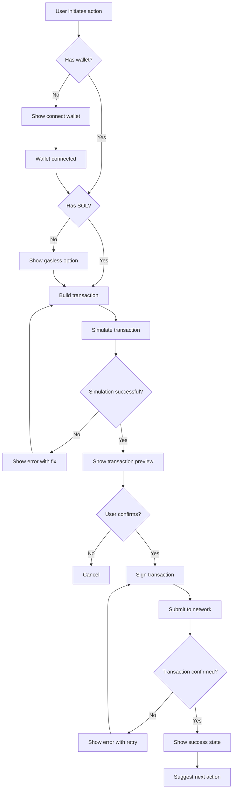

# Transaction Flow Diagram

## Flow Descriptions

### Wallet Connection
- Check if user has wallet installed
- If no, show connect wallet prompt
- If yes, check SOL balance

### Gasless Path
- If user has no SOL, offer gasless sponsorship
- Validate user is within rate limit
- Build transaction with fee payer proxy

### Transaction Simulation
- Simulate transaction before signing
- Show preview of what will change
- Display any errors before user signs

### Signing and Confirmation
- User signs transaction with wallet
- Submit to network with priority fee
- Monitor confirmation status
- Show success or error with retry option

### Success State
- Display what changed (balance, NFT, position)
- Provide link to transaction on explorer
- Suggest natural next action
